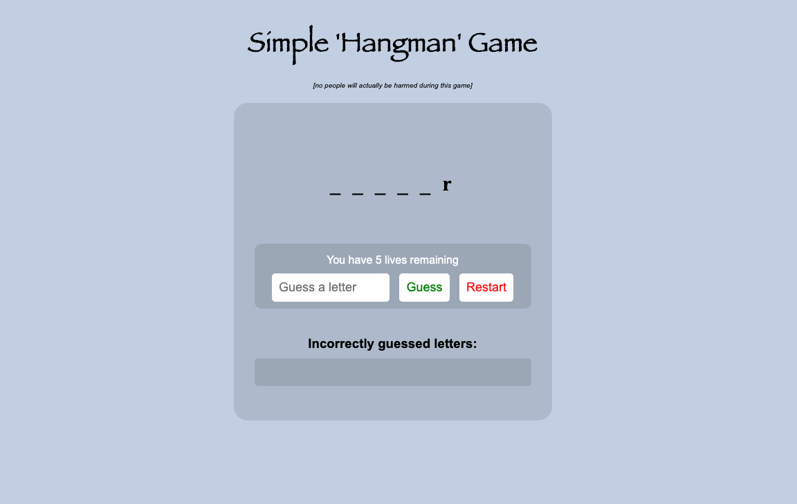

## Project: Galgje met Unit Tests
We gaan het welbekende spel Galgje maken met JavaScript. 
De focus ligt deze week op: unit tests maken + styling. 

###### Clone of download het project van Github. Je kunt gelijk starten door index.html te openen.

### Project doel
Doel 1: Refactor de code en zorg dat de game blijft werken. 
Doel 2: style de game zodat het gebruiksvriendelijker wordt 

### Project eisen
- [x] Start bij elke functionaliteit elke keer met het schrijven van de unit tests
- [x] De volgende functionaliteiten moeten (minimaal) worden getest (meer mag): 
    - starten van de game d.m.v. het kiezen van het woord 
    - checken of een letter voorkomt in het woord
    - updaten van het aantal pogingen van de gebruiker
    - updaten van de lijst met letters die al geraden zijn door de gebruiker
    - verliezen van de game wanneer er geen pogingen meer over zijn
    - winnen van de game
- [x] Gebruik CSS Grid of Flexbox voor een mooie indeling.
- [x] Gebruik minsten 2 animaties naar keuze: 1 voor winnen, 1 voor verliezen.
- [x] Gebruik styling voor de buttons + zorg dat er kleur verandert in de button wanneer je hovert.
- [x]Gebruik nog veel meer styling zodat de game echt awesome wordt. 💥

### Credits
Aan de geweldige mensen van Winc Academy.

